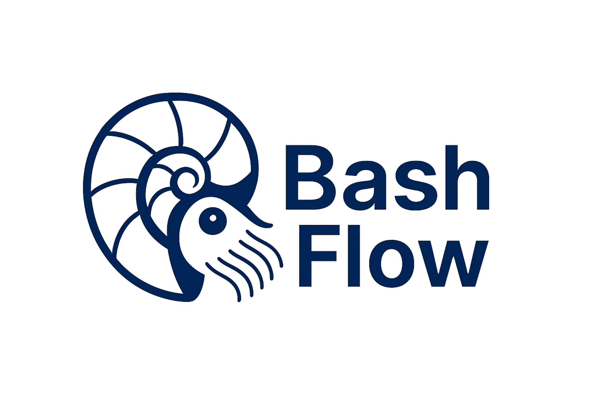

# 🚀 BashFlow

🇪🇸 

Framework modular en Bash para automatización distribuida, inspirado en la filosofía de Ansible pero optimizado para entornos shell-friendly.

🇬🇧 

A modular Bash framework for distributed automation, inspired by the Ansible philosophy but optimized for shell-friendly environments.

## ✨ Características /Features
🇪🇸
- Inventario estilo YAML con grupos, variables y extensibilidad
- Módulos autocontenidos e idempotentes
- Plantillas para onboarding rápido
- Compatibilidad con `.deb`, `.rpm`, y entornos híbridos (Windows vía community)
- Documentación clara y ejemplos prácticos

---
🇬🇧
- YAML-style inventory with groups, variables, and extensibility
- Self-contained and idempotent modules
- Templates for rapid onboarding
- Support for `.deb`, `.rpm`, and hybrid environments (Windows via community)
- Clear documentation and practical examples

## 📦 Estructura / Structure
🇪🇸
- `core/`: módulos base y utilidades
- `community_modules/`: módulos especializados o experimentales
- `inventory/`: definición de hosts, grupos y variables
- `examples/`: playbooks de ejemplo
- `doc/`: documentacion del framework y uso de los módulos

---
🇬🇧
- `core/`: base modules and utilities
- `community_modules/`: specialized or experimental modules
- `inventory/`: definition of hosts, groups, and variables
- `examples/`: example playbooks
- `doc/`: framework documentation and module usage

## 🤝 Contribuir / Contribute
🇪🇸

Consulta [`CONTRIBUTING.md`](CONTRIBUTING.md) para saber cómo aportar módulos, documentación o ideas.

🇬🇧

See [`CONTRIBUTING.md`](CONTRIBUTING.md) to learn how to contribute modules, documentation, or ideas.

## 📄 Licencia / License
🇪🇸

Este proyecto está bajo la licencia **GNU GPLv3** — garantiza que BashFlow y cualquier derivado permanezcan libres y abiertos.  

Consulta el archivo [`LICENSE`](LICENSE) para más detalles.  

🇬🇧

This project is licensed under **GNU GPLv3** — ensuring BashFlow and any derivative remains free and open.

See the [`LICENSE`](LICENSE) file for details.

---

## Detalles extra  / Extra details

🇪🇸

Por favor lea el documento [DETAILS-es.md](docs/DETAILS-es.md)

🇬🇧

Please read the [DETAILS-en.md](docs/DETAILS-en.md) document

---
